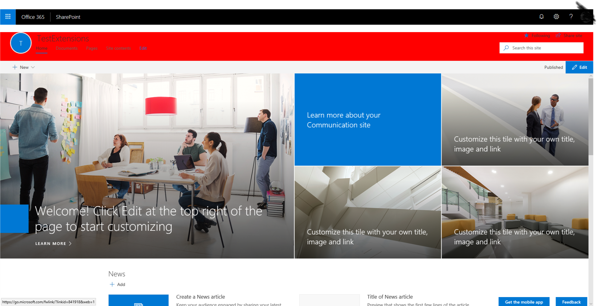

# SPFx Applications Customiser CSS Injection

## Summary

This sample shows how to modify a left navigation element on modern pages.

> **Note**: This code is provided as a sample only. Keep in mind that Microsoft may change page elements and styles at any time, rendering your custom CSS useless. It is preferrable to use well-known HTML element placeholders.

When you need to make minor cosmetic changes to modern pages (e.g.:  match your corporate branding guidelines) and cannot use placeholders,you can create a custom CSS and inject on every modern page.

In this example, we deploy the CSS in a shared location; this allows us to change the CSS file at any time without re-deploying or re-configuring the application customizer.

You can deploy the application customizer with different settings to point to different CSS files.

Please refrain from making drastic changes that may negatively impact your users' experience. If you experience issues with modern pages, please try disabling the extension before calling Microsoft Support to ensure that the issue isn't caused by your custom CSS.

## Used SharePoint Framework Version

## Applies to

* [SharePoint Framework Extensions](https://dev.office.com/sharepoint/docs/spfx/extensions/overview-extensions)
* [Office 365 developer tenant](http://dev.office.com/sharepoint/docs/spfx/set-up-your-developer-tenant)

## Solution

Solution|Author(s)
--------|---------

## Version history

Version|Date|Comments
-------|----|--------

## Disclaimer

**THIS CODE IS PROVIDED *AS IS* WITHOUT WARRANTY OF ANY KIND, EITHER EXPRESS OR IMPLIED, INCLUDING ANY IMPLIED WARRANTIES OF FITNESS FOR A PARTICULAR PURPOSE, MERCHANTABILITY, OR NON-INFRINGEMENT.**

---

## Minimal Path to Awesome

### Build the solution

1. clone repo
2. Run `npm install`
gulp bundle --ship
gulp package-solution --ship

### Manual deployment

1. Upload the `react-application-injectcss.sppkg` from the `sharepoint` folder to your App catalog.
2. When prompted to deploy to all sites, choose the option that suits your needs.

3. Run `gulp bundle --ship`
4. Run `gulp package-solution --ship`
5. Upload the `react-application-injectcss.sppkg` from the `sharepoint` folder to your App catalog.
6. When prompted to deploy to all sites, choose the option that suits your needs.

## Features

Sample SharePoint Framework Application Customiser which modifies left nav properties.

This sample illustrates the following concepts on top of the SharePoint Framework:

* HTML manipulation

